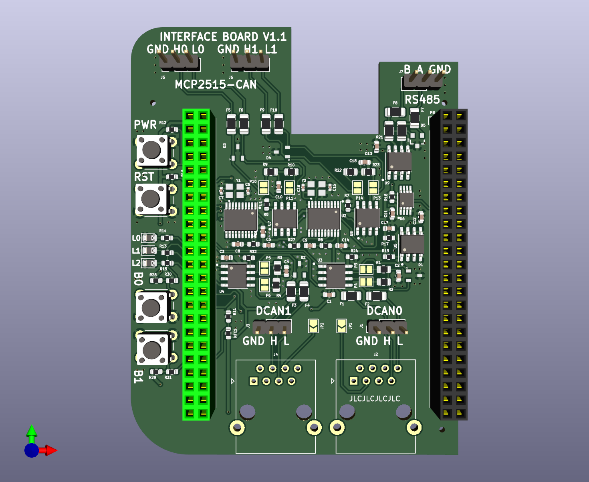

# bbb-can-bus-cape
beaglebone black cape:
- 4x CANbus (up to 1Mbit, 2x direct CAN, 2x MCP2515)
- 1x RS485 up to 10 Mbit

## __design untested yet !__

Credits for the design to [@voloviq/bbb-can-bus-cape](https://github.com/voloviq/bbb-can-bus-cape)  
Design was adjusted for:
- currently available components from jlcpcb
- compatible interface for home ESS (Victron Multiplus 2 ; Victron MPPT RS 450 ; Pylontech US5000C)

## board 3D view

